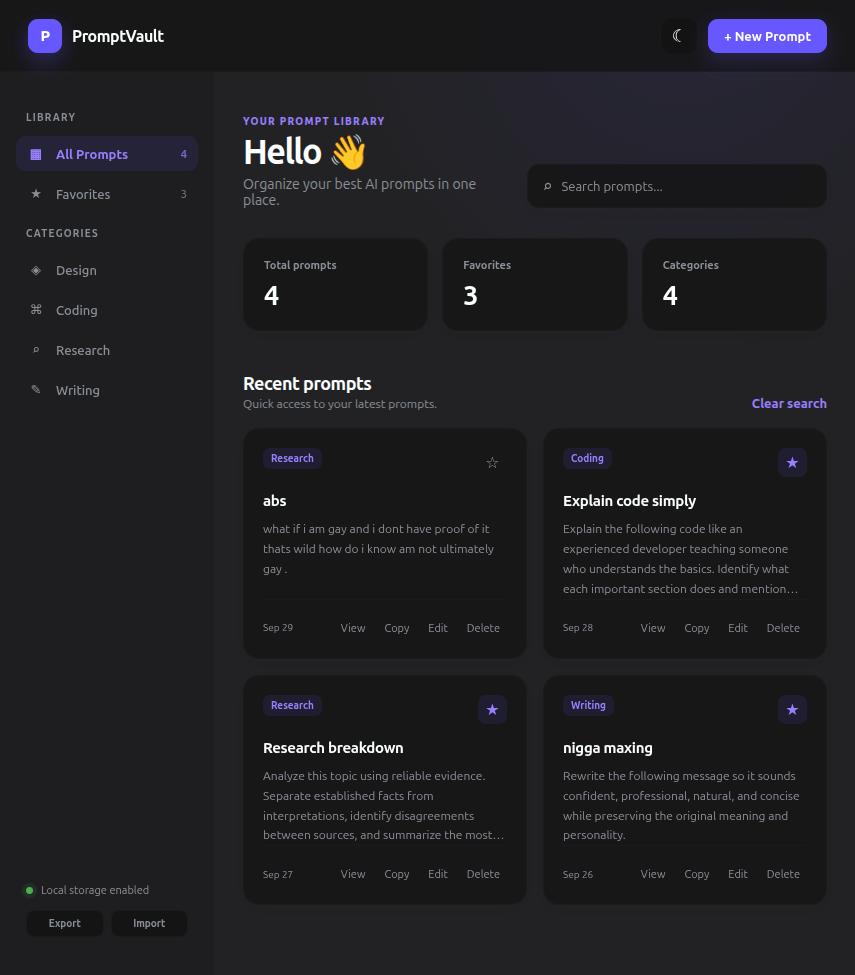
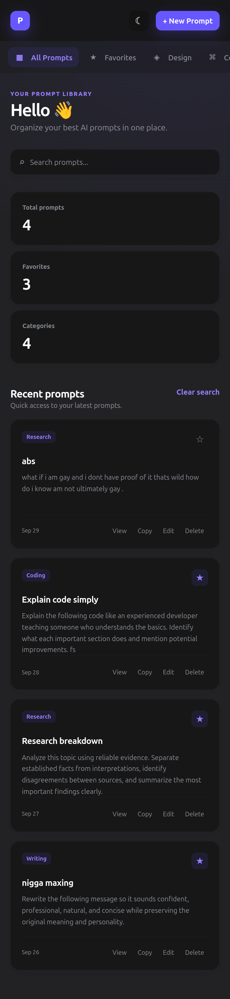

# PromptVault
#and before y`all niggas start screaming 
#yes i designed this app from scratch and used ai to sample my work down to simplicity
#took me a short span of 8 hours for the entire project too

#anyways....

A clean, local-first AI prompt manager built to organize, edit, search, favorite, copy, and back up reusable AI prompts.

## Preview

### Desktop



### Mobile



##Features

- Create, edit, and delete prompts
- Organize prompts by category
- Search prompts instantly
- Mark prompts as favorites
- View full prompts in a dedicated detail modal
- Copy prompts directly to the clipboard
- Live word and character counting
- Track when prompts were last edited
- Import and export prompts as JSON backups
- Keyboard shortcuts for faster navigation
- Dynamic time-based greetings
- Responsive interface for desktop and mobile
- Toast notifications for important actions
- Local storage for persistent browser-based data

## Keyboard Shortcuts
#some dont work due to web restrictions but you`ll get a hang of it fr.

| Shortcut | Action |
|----------|--------|
| `Ctrl + K` | Focus search |
| `Ctrl + N` | Create a new prompt |
| `Esc` | Close the active modal |

## Tech Stack

- HTML5
- CSS3
- Vanilla JavaScript
- Browser Local Storage
- JSON import/export

## Data & Privacy

PromptVault stores prompt data locally in the browser using `localStorage`.

No account or external database is required for the core application.

Use the built-in **Export** feature to create a portable JSON backup of your prompts.

## Running Locally

Clone the repository:

```bash
git clone  https://github.com/avonxate-hub/promptvault.git
cd promptvault
